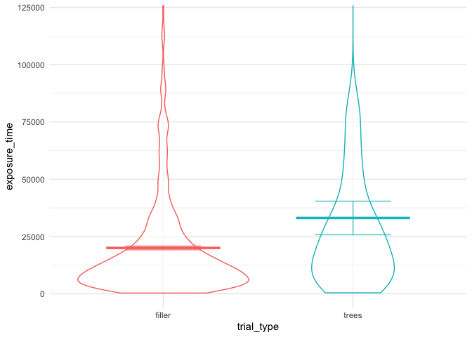
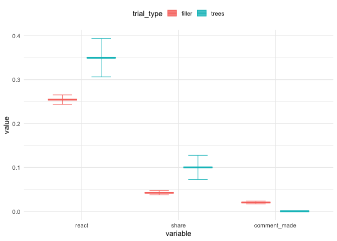
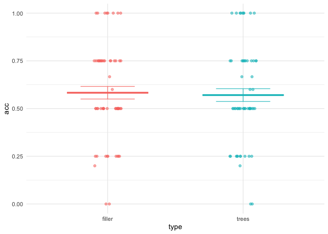
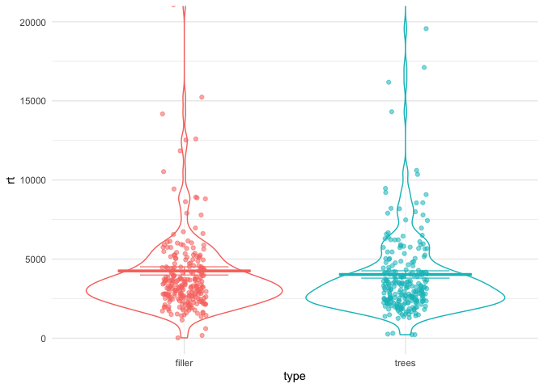

SM Trees Baseline N=60
================
dcr
2025-09-25

60 person pilot run with 16 posts.

Later, update this to use base R and download the data direct from
github

Read in data using eyethinkdata tools

``` r
library(eyethinkdata)
```

    ## Loading required package: ggplot2

    ## Loading required package: data.table

``` r
data <- data_collator_gorilla("data")
```

# Social Media presentation

Make pres_data_full by filtering gorilla task data to get the
information about social media posts. This has one row per social media
reaction, share, comment, or continue.

We want the data with one row per post, and all the reactions in
different columns. Let’s start with the exposure duration, how long they
looked at each post before pressing continue button.

``` r
pres_data <- data$data_task[Display=="post_single" &  Response.Type=="continue",
                            .(pid,datetime=Local.Date.and.Time,trial=Trial.Number,
                                                    trial_type=Spreadsheet..type,
                                                    item=Spreadsheet..item, 
                                                    exposure_time=rt)]
```

Now let’s get all the reactions. Then we’ll reshape to one trial per
line, and add to pres_data via the participant ID and the trial number.
We then set the NAs to zero to indicate where a reaction wasn’t given.
And we count up the total reaction count. Note that we could get rt data
for the reactions if we wanted.

``` r
react_data <- data$data_task[Display=="post_single" &  Response.Type=="action" & Tag =="react",
                            .(pid,trial=Trial.Number,reaction=paste0("react_",Response),rt,react=1)]
pres_data <- pid_merge(pres_data,dcast(react_data,fun.aggregate = sum,
                                       formula = pid+trial~reaction,value.var = "react"),
                       link = c("pid","trial"))
pres_data[is.na(pres_data),] <- 0
pres_data[, react:=react_angry+react_disgust +react_heart+react_laugh+react_like+react_sad+react_surprise]
```

Let’s do the same with the shares

``` r
share_data <- data$data_task[Display=="post_single" &  Response.Type=="action" & Tag =="share",
                            .(pid,trial=Trial.Number,share=1)]
pres_data <- pid_merge(pres_data,share_data,
                       link = c("pid","trial"))
pres_data[is.na(share),share:=0]
```

Now if any comments are made, we can add them to pres_data

``` r
comment_data <- data$data_task[Display=="post_single" &  Response.Type=="action" & Tag =="comment",
                            .(pid,trial=Trial.Number,comment = Response)]
pres_data <- pid_merge(pres_data,comment_data,link = c("pid","trial"))
pres_data$comment_made <- 0
pres_data[!is.na(comment)]$comment_made <- 1
```

# Demographics and behavioural intentions

Get the survey data from the start and the behavioural intentions data
from the end

``` r
data_demo <- gorilla_q_parse_qb2(data,qlist = "Demographics")
data_behav <- data$data_q[Task.Name=="Behavioural intentions" & Response.Type=="response" &  (Question.Key=="trees_find_out" | Question.Key=="trees_water")]
data_behav[,Response:=as.numeric(Response)]
data_behav <- dcast(data_behav,
      pid~Question.Key,value.var = "Response")
```

# Memory

Labeling the memory items - we won’t need this after pilot data as
labels will be embedded

``` r
mem_data <- data$data_task[Display=="test item"]
```

Now we can get the memory data performance and process it

``` r
mem_data <- data$data_task[Display=="test item" &  (Response=="true" | Response=="false"),
                            .(pid,trial=Trial.Number,
                              type=Spreadsheet..type,memitem=Spreadsheet..memitem,
                              response=ifelse(Response=="true",TRUE,FALSE),
                              acc=Correct,rt)]
```

Score the memory data

``` r
memacc_data <- dcast(mem_data,pid~type,value.var = "acc",fun.aggregate = mean)
setnames(memacc_data,old=c("filler","trees"),new=c("mem_acc_filler","mem_acc_trees"))
memrt_data <-dcast(mem_data[acc==1],pid~type,value.var = "rt",fun.aggregate = mean)
setnames(memrt_data,old=c("filler","trees"),new=c("mem_rt_filler","mem_rt_trees"))
```

I don’t think that we need dprime here

``` r
# mem_data[response==TRUE & acc==1,s:="hit"]
# mem_data[response==TRUE & acc==0,s:="miss"]
# mem_data[response==FALSE & acc==1,s:="cr"]
# mem_data[response==FALSE & acc==0,s:="fa"]
# 
# mdw <- dcast(mem_data[,.(n=.N),by=.(pid,type,s)],
#                formula = pid+type~s,
#                value.var = "n",fill = 0)
# 
#   ## exclude items with zero critical or zero foils
#   mdw <- mdw[ !(cr+fa==0 | hit+miss==0) ]
# 
#   mdw <- mdw[,psycho::dprime(n_hit=hit,n_miss=miss,n_fa = fa,n_cr = cr),by=.(pid,type)]
```

# Combine into participants data

Now we want to combine all these data sources into one dataframe with
one row per participant

``` r
pd <- pid_merge(data_demo,
dcast(pres_data[trial_type=="filler" | trial_type=="trees"],pid~trial_type,fun.aggregate = mean,value.var =  c("exposure_time", "react", "share",  "comment_made"  )),
data_behav,
memacc_data,
memrt_data)
pd <- pd[!is.na(pid)]
write.csv(pd,"participant_data.csv")
```

# Analyse the data

Lets see how the design effects things…

## Exposure time

We should trim outliers systematically - here just cutting off at
120sec. Also perhaps discard those with \<1sec?

``` r
pirateye(pres_data,x_condition = "trial_type",dv="exposure_time",ylim = c(0,120000),dots=F)
```

<!-- -->

## Reactions, shares, comments

``` r
pirateye(pres_data, x_condition = "variable",colour_condition = "trial_type",
         dv=c("react","react","share",  "share",
              "comment_made",  "comment_made"  ),violin = F,dots=F)
```

<!-- -->

## Memory accuracy

Accuracy across 4 items

``` r
pirateye(mem_data[,.(acc=mean(acc)),by=.(pid,type)], colour_condition = "type",
           dv="acc",violin = F)
```

<!-- -->

So they are slghtly above chance for all posts

# RT when correct

``` r
pirateye(mem_data, colour_condition = "type",
         dv="rt",ylim = c(0,20000))
```

<!-- -->

# Behavioural intentions

``` r
pirateye(data_behav, colour_condition = "variable",
         dv=c("trees_find_out","trees_water"))
```

<!-- -->
