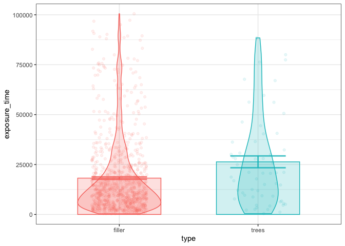

SM Trees Baseline N=60
================
dcr
2025-09-25

60 person pilot run with 16 posts.

Here are the packages that this code uses

``` r
library(data.table) 
library(ggplot2)
```

Download data archive from github, and unzip into a folder called
“gorilla_data”

``` r
download.file(url="https://github.com/dcr-eyethink/crisps/raw/refs/heads/master/SM%20baseline/gorilla_data.zip",destfile = "gorilla_data.zip")
unzip("gorilla_data.zip")
```

This folder contains the download from gorilla for the baseline
experiment. If you have more gorilla data downloads from other
experiments, you could add them into this folder and run the same code
below to import it all. I’ve defined a handy function to read in gorilla
data files for the tasks and the questionnaires, and put them into a
list called data.

``` r
# this is a function to import gorilla data into data$task and data$questionnaire
gorilla_import <- function(folder){
csvfiles <- list.files(folder,pattern=".csv",full.names = T, recursive = T)
data <- list()
for (datatype in c("task","questionnaire")){
  compiled_data <- data.table()
for  (f in grep(x=csvfiles,pattern=datatype,value=T)){
  newdata <- read.csv(f)  # read in data file
  newdata$filename <- f # add in the file name to data so we can check where data came from
  newdata$pid <- as.factor(newdata$Participant.Private.ID) # make an variable for an anon. participant ID code
  # make sure that the combined data has the column names from all files
  nn <- colnames(newdata)[!colnames(newdata) %in% colnames(compiled_data)]
  if(length(nn)>0){compiled_data[,nn] <- NA}
  nn <- colnames(compiled_data)[!colnames(compiled_data) %in% colnames(newdata)]
  if(length(nn)>0){newdata[,nn] <- NA}
  compiled_data <- rbind(compiled_data,newdata) # compile data
}
  data[[datatype]] <- compiled_data
}
  return(data)
}

data <- gorilla_import("gorilla_data")
```

# Social Media presentation

Make pres_data by filtering gorilla task data to get the information
about social media posts. This will eventually one row per social media
reaction, share, comment, or continue. Let’s start with the exposure
duration, how long they looked at each post before pressing continue
button.

``` r
pres_data <- data$task[Display=="post_single" &  Response.Type=="continue",
                            .(pid,datetime=Local.Date.and.Time,trial=Trial.Number,
                                                    type=Spreadsheet..type,
                                                    item=Spreadsheet..item, 
                                                    exposure_time=Reaction.Time)]
```

Lets identify trials that have an exposure time outside of 3 SDs from
the mean

``` r
pres_data[,use:=TRUE]
pres_data[exposure_time<mean(exposure_time)-3*sd(exposure_time) | 
            exposure_time>mean(exposure_time)+3*sd(exposure_time),
          use:=FALSE]
pres_data[!(use)]
```

    ##          pid            datetime trial   type     item exposure_time    use
    ##       <fctr>              <char> <int> <char>   <char>         <num> <lgcl>
    ##  1: 14139671 25/09/2025 12:18:16     3 filler    yacht      136306.0  FALSE
    ##  2: 14139674 25/09/2025 12:22:16     6 filler    swaps      221308.7  FALSE
    ##  3: 14139689 25/09/2025 12:23:54     1 filler    swaps      111618.2  FALSE
    ##  4: 14139689 25/09/2025 12:31:23     9 filler starwars      124093.4  FALSE
    ##  5: 14139709 25/09/2025 12:25:34    10 filler    swaps      112902.0  FALSE
    ##  6: 14139712 25/09/2025 12:30:51    16 filler    swaps      117518.2  FALSE
    ##  7: 14139715 25/09/2025 12:23:52     3 filler    swaps      214812.4  FALSE
    ##  8: 14139715 25/09/2025 12:30:54    11 filler starwars      113917.9  FALSE
    ##  9: 14139719 25/09/2025 12:26:54     2 filler starwars      224648.1  FALSE
    ## 10: 14139719 25/09/2025 12:29:25     4 filler     nasa      140267.4  FALSE
    ## 11: 14139721 25/09/2025 12:19:16     1 filler     fish      113113.3  FALSE
    ## 12: 14139739 25/09/2025 12:52:02     8  trees    trees      430695.1  FALSE
    ## 13: 14139743 25/09/2025 12:23:22     1 filler    swaps      128657.5  FALSE
    ## 14: 14139763 25/09/2025 12:44:40     1 filler    swaps      109758.5  FALSE

Now let’s filter and extract all the reactions. Then we’ll reshape to
one trial per line, and add to pres_data via the participant ID and the
trial number. We then set the NAs to zero to indicate where a reaction
wasn’t given. And we count up the total reaction count. Note that we
could get rt data for the reactions if we wanted.

``` r
react_data <- data$task[Display=="post_single" &  Response.Type=="action" & Tag =="react",
                            .(pid,trial=Trial.Number,
                              reaction=paste0("react_",Response),rt,react=1)]
react_data <- dcast(react_data,fun.aggregate = sum,formula = pid+trial~reaction,value.var = "react") #reshape to one post per line
pres_data <- merge(pres_data,react_data, by = c("pid","trial"),all.x = T) #merge with pres_data
pres_data[is.na(pres_data),] <- 0 # replace NAs where there was no reaction with zeros so we can count up properly
pres_data[, react:=react_angry+react_disgust +react_heart+react_laugh+react_like+react_sad+react_surprise] # count up all the reactions
```

Let’s do the same with the data about shares

``` r
share_data <- data$task[Display=="post_single" &  Response.Type=="action" & Tag =="share",
                            .(pid,trial=Trial.Number,share=1)]
pres_data <- merge(pres_data,share_data,by= c("pid","trial"),all.x = T)
pres_data[is.na(share),share:=0]
```

Now if any comments are made, we can add the comments to pres_data, and
make a comment_made varible (0 or 1) so that we can count them

``` r
comment_data <- data$task[Display=="post_single" &  Response.Type=="action" & Tag =="comment",
                            .(pid,trial=Trial.Number,comment = Response)]
pres_data <- merge(pres_data,comment_data,by = c("pid","trial"),all.x = T)
pres_data$comment_made <- 0
pres_data[!is.na(comment)]$comment_made <- 1
write.csv(pres_data,"presentation_data.csv")
```

# Demographics and behavioural intentions

Get the survey data from the start

``` r
data_demo <- data$questionnaire[Task.Name=="Demographics",.(pid, item=Object.Name,key=Key,r=Response)]  #filter for info
data_demo <-dcast(data_demo[!r=="BEGIN" & !r=="END" & !key==""],
      pid~item+key, value.var = "r")   #reshape
# here we are tidying up column names and types, making sure that numbers are identified correctly 
number_cols <- c("age_value","live_dist_value", "live_time_value",
                 grep(x=colnames(data_demo),pattern="quantised",value=T),
                 grep(x=colnames(data_demo),pattern="socialmed_platform",value=T))
for (j in number_cols) {set(data_demo, j = j, value = as.numeric(data_demo[[j]]))}
cols_value <- grep(x=colnames(data_demo),pattern="value",value=T)
setnames(data_demo, old = cols_value, new=gsub(x=cols_value,pattern = "_value",replacement = "") )
```

And the behavioural intentions data from the end

``` r
data_behav <- data$questionnaire[Task.Name=="Behavioural intentions" & Key=="value",
                                 .(pid, item=Object.Name,response=as.numeric(Response))]  #filter for info
write.csv(data_behav,"behav_intentions.csv")
```

# Memory

Now we can get the memory data performance and process it

``` r
mem_data <- data$task[Display=="test item" &  (Response=="true" | Response=="false"),
                            .(pid,trial=Trial.Number,
                              type=Spreadsheet..type,memitem=Spreadsheet..memitem,
                              response=ifelse(Response=="true",TRUE,FALSE),
                              acc=Correct,rt=as.numeric(Reaction.Time))]
```

Let’s identify outliers. If rt is greater than 3 SDs from the mean then
use = FALSE, otherwise true

``` r
mem_data[,use:=TRUE]
mem_data[rt<mean(rt)-3*sd(rt) | rt>mean(rt)+3*sd(rt), use:=FALSE]
```

Score participants’ memory data by calculating mean accuracy for trees
and filler trials, excluding outliers.

``` r
memacc_data <- dcast(mem_data[(use)],pid~type,value.var = "acc",fun.aggregate = mean)
setnames(memacc_data,old=c("filler","trees"),new=c("mem_acc_filler","mem_acc_trees"))
memrt_data <-dcast(mem_data[acc==1 & (use)],pid~type,value.var = "rt",fun.aggregate = mean)
setnames(memrt_data,old=c("filler","trees"),new=c("mem_rt_filler","mem_rt_trees"))
write.csv(mem_data,"memory_data.csv")
```

# Combine into participants data

Now we want to combine all these data sources into one dataframe with
one row per participant. We’re just going to include data that’s
relevent to the trees in this summary participant data

``` r
pd <- merge(x=data_demo,by = "pid",all = T,
            y=pres_data[type=="trees",.(pid,exposure_time, react, share,  comment_made,comment)])
pd <- merge(x=pd,by = "pid",all = T,
            y=dcast(data_behav,pid~item,
                    value.var = "response")[,.(pid, trees_find_out, trees_water)] ) #just get the tree intentions
pd <- merge(x=pd,by = "pid",all = T,y=memacc_data)
pd <- merge(x=pd,by = "pid",all = T,y=memrt_data)
            
write.csv(pd,"participant_data.csv")
```

# Analyse the data

Now we’re going to plat some descriptive stats comparing the filler
trials with the trees trials. In the full experiment howewver, we’ll be
comparing the trees trial with an experimental contrast where something
has been manipulated.

First define a nice RDI plot that we can reuse

ADD IN SUMMARY TABLE PRINTED OUT

``` r
means_plot <-function(data,x,y,violin=F,dots=F){ 
  p <- ggplot(data=data, aes(x=.data[[x]],y=.data[[y]],colour=.data[[x]],fill=.data[[x]])) + 
    theme_bw()+theme(legend.position = "none")+
    stat_summary(fun = 'mean',geom = 'bar', alpha=.2,width=.6)+
    stat_summary(fun.data = mean_se,  geom = "errorbar",alpha=.8,width=.4,size=1)
  if (violin){p <- p+geom_violin(alpha=.2, width=.6)}
  if (dots){p <- p+geom_point(position=position_jitterdodge(),alpha=.1)}
  meanstable <- data[,.(mean=mean(get(y)),sd=sd(get(y)),N=.N) ,by=x]
  return(list(meanstable=meanstable,plot=p))
  }
```

## Exposure time

How long (milliseconds) did they look at each post

``` r
means_plot(data=pres_data[(use)],x="type",y="exposure_time",violin = T,dots=T)
```

    ## $meanstable
    ##      type     mean       sd     N
    ##    <char>    <num>    <num> <int>
    ## 1: filler 18194.48 19017.28   887
    ## 2:  trees 26354.11 22696.76    59
    ## 
    ## $plot

<!-- -->

## Reactions, shares, comments

``` r
means_plot(data=pres_data[(use)],x="type",y="react")
```

    ## $meanstable
    ##      type      mean        sd     N
    ##    <char>     <num>     <num> <int>
    ## 1: filler 0.2491545 0.4531516   887
    ## 2:  trees 0.3389831 0.4774274    59
    ## 
    ## $plot

<!-- -->

## Memory accuracy

Accuracy across 4 items

``` r
means_plot(data=mem_data[,.(acc=mean(acc)),by=.(pid,type)],x="type",y="acc",dots=T)
```

    ## $meanstable
    ##      type      mean        sd     N
    ##    <char>     <num>     <num> <int>
    ## 1:  trees 0.5705556 0.2601131    60
    ## 2: filler 0.5827778 0.2551719    60
    ## 
    ## $plot

<!-- -->

So they are slghtly above chance for all posts

# RT when correct

``` r
means_plot(mem_data[(use) & acc==1], x = "type",y="rt",violin = T,dots=T)
```

    ## $meanstable
    ##      type     mean       sd     N
    ##    <char>    <num>    <num> <int>
    ## 1: filler 3821.667 2214.691   139
    ## 2:  trees 3808.232 2037.034   138
    ## 
    ## $plot

<!-- -->

# Behavioural intentions

``` r
result <- means_plot(data_behav, x = "item",y="response",violin = F,dots=T)
result$meanstable
```

    ##              item     mean       sd     N
    ##            <char>    <num>    <num> <int>
    ## 1: trees_find_out 3.550000 1.779592    60
    ## 2:    trees_water 3.616667 1.718214    60
    ## 3:  filler_travel 5.350000 1.470904    60
    ## 4:   filler_watch 1.916667 1.532602    60
    ## 5:   filler_pizza 5.183333 1.589069    60
    ## 6:     filler_sci 4.916667 1.576218    60

``` r
result$plot+ylim(0,8)
```

<!-- -->
